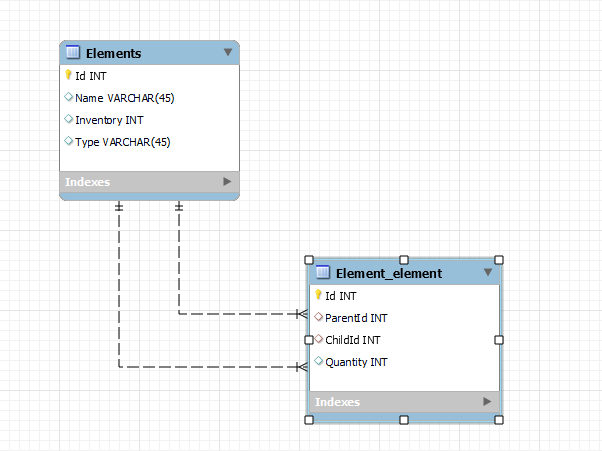

# Finished product Calculator

This Laravel project calculates the maximum number of Finished product that can be created from given parts and their inventory.

## Getting Started

### Prerequisites

Make sure you have the following software installed:

-   PHP >= 8.2
-   Composer
-   MySQL or SQLite (for the database)

### Installation

1. **Clone the repository:**

    `bash git clone https://github.com/abbas0926/qoblex_challenge.git`

    `cd qoblex_challenge `

2. **Install dependencies:**
   `composer install `
3. **Set up the environment:**
   Copy the .env.example file to .env:
   `cp .env.example .env `
   Update the .env file with your database configuration.

For example:

    ```
    DB_CONNECTION=mysql 
    DB_HOST=127.0.0.1
    DB_PORT=3306
    DB_DATABASE=bundle_calculator
    DB_USERNAME=root
    DB_PASSWORD= 
    ```
4. **Generate application key:**

`php artisan key:generate`

5. **Run migrations and seed example data:**
   `php artisan migrate --seed`

### Running the Application

1. **Start the development server:**

    `php artisan serve`

2. **Access the application:**

Open your web browser and go to `http://localhost:8000`.

### Endpoints

To calculate the maximum number of bundles, hit the following endpoints:

## GET /get-bundles:

This endpoint returns the Elements that can be finished products or are composed of parts, so we can use their IDs to test the next endpoint.

Example Request:
`curl http://localhost:8000/get-bundles`

Example Response:

```
{
"elements":[[{"id":5,"name":"Wheel"},
{"id":6,"name":"Bike"}]],
"status":"success"
}

```


## GET /calculate-stock:

This endpoint returns the maximum number of finished products and bundles that can be created from the given parts and their inventory.

Example Request:

```curl http://localhost:8000/calculate-stock/{Id}```

Example Response:
```
{
"element":"Bike",
"max_bundles":17,
"status":"success"
}

```


# Relational diagram

As you can see in the following diagram, we have to  tables "Elements" and relationship table "Element_elemen" where the  tables have two relationships throught the ParentId and the ChildId Attributes from the Element_element table, which both refer to the Id from the elements table. 

